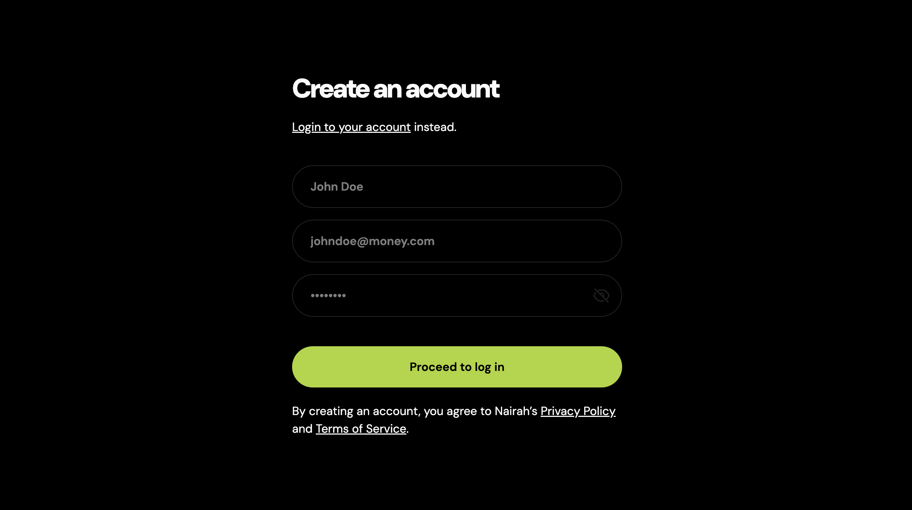

# Nairah

A React + Vite authentication app with signup, login, protected routing, and a simple dashboard.



## Features

- User signup and login with API integration (`axios`)
- Protected dashboard route using `react-router-dom`
- Session persistence with `sessionStorage`
- Toast notifications for auth success and errors (`react-hot-toast`)
- Tailwind CSS styling

## Tech Stack

- React 19
- Vite 7
- React Router DOM 7
- Axios
- Tailwind CSS 4
- ESLint

## Project Structure

```text
src/
  components/
    Button.jsx
    Input.jsx
  contexts/
    UserContext.jsx
    userContextInstance.js
  hooks/
    useUser.js
  pages/
    Dashboard.jsx
    Login.jsx
    ProtectedRoute.jsx
    Signup.jsx
    Notfound.jsx
  App.jsx
  main.jsx
```

## Routes

- `/` -> Protected dashboard
- `/login` -> Login page
- `/signup` -> Signup page
- `*` -> Not found page

## Authentication Flow

- `UserProvider` handles auth state (`user`, `token`, `loading`) and exposes:
  - `login(email, password)`
  - `signup(fullname, email, password)`
  - `logout()`
- On login/signup success:
  - token is saved to `sessionStorage` as `token` (if returned)
  - email is saved to `sessionStorage` as `email`
- `ProtectedRoute` checks for `token` and redirects unauthenticated users to `/login`.

API base URL used by the app:

```text
https://api.mantahq.com/api/workflow/trevor/nairah/nairah-auth
```

## Getting Started

### Prerequisites

- Node.js 18+ (recommended)
- npm

### Install

```bash
npm install
```

### Run in development

```bash
npm run dev
```

### Build for production

```bash
npm run build
```

### Preview production build

```bash
npm run preview
```

### Lint

```bash
npm run lint
```

## Notes

- Form-level validation beyond HTML `required` is still minimal.
- `sessionStorage` means auth state is cleared when the browser/tab session ends.

## License

This project is currently unlicensed.
